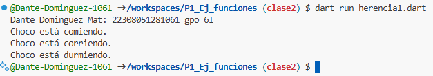

Crear una clase animal con los atributos (id_animal, nombre y raza) y una funcion comer(). Crear otra clase perro con herencia animal con las funciones correr() y otra dormir(). lenguaje dart

Salida de resultados

