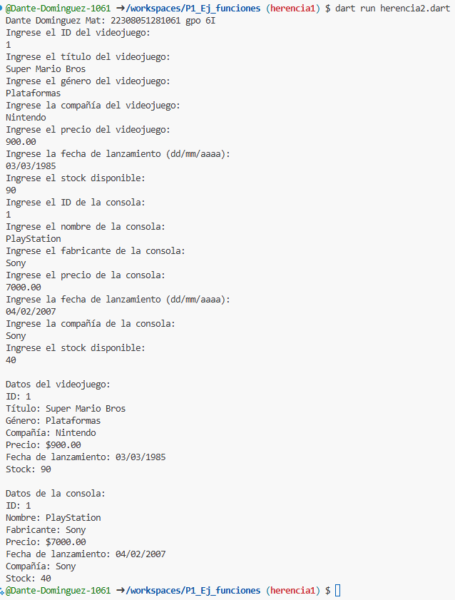

Crear la clase videojuego con los atributos (id_videojuego, titulo, genero, compañia, precio, fecha de lanzamiento, stock) con una funcion capturadatos(), con interaccion de interfaz de usuario. Crear la clase DatosVideojuego con herencia Videojuego y una funcion mostrarDatos(). lenguaje dart. Crear la clase consola con los atributos (id_consola, nombre, fabricante, precio, fecha de lanzamiento, compañia, stock) con una funcion capturadatos(), con interaccion de interfaz de usuario. Crear la clase DatosMascota con herencia Mascota y una funcion mostrarDatos(). lenguaje dart

Salida de datos

