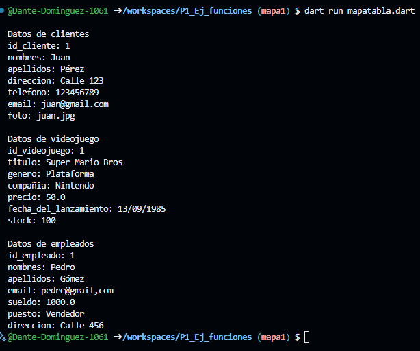

Crear una tabla clientes con string, dynamic y mostrar los datos con un for each 

Crear una tabla videojuego con string, dynamic y mostrar los datos con un for each 

Crear una tabla empleados con string, dynamic y mostrar los datos con un for each 

Salida de datos:
